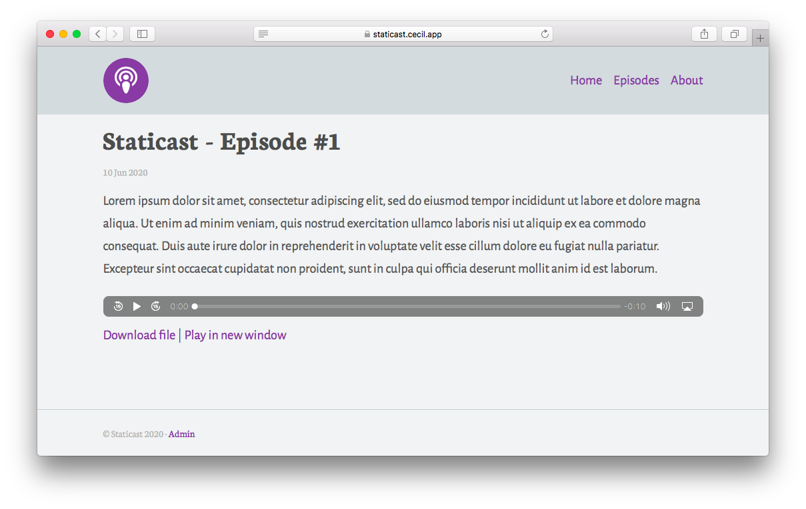
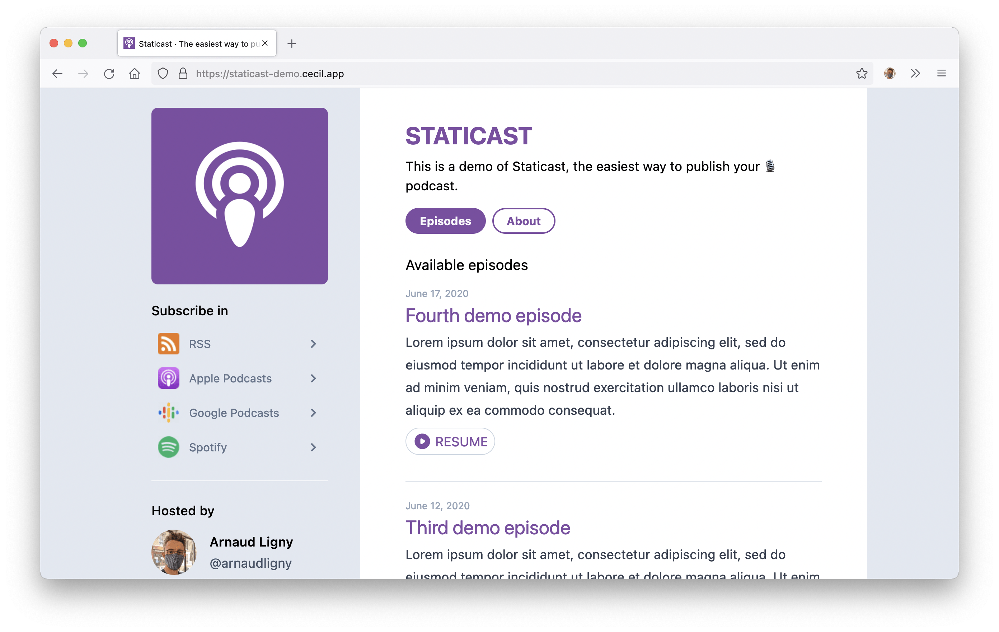
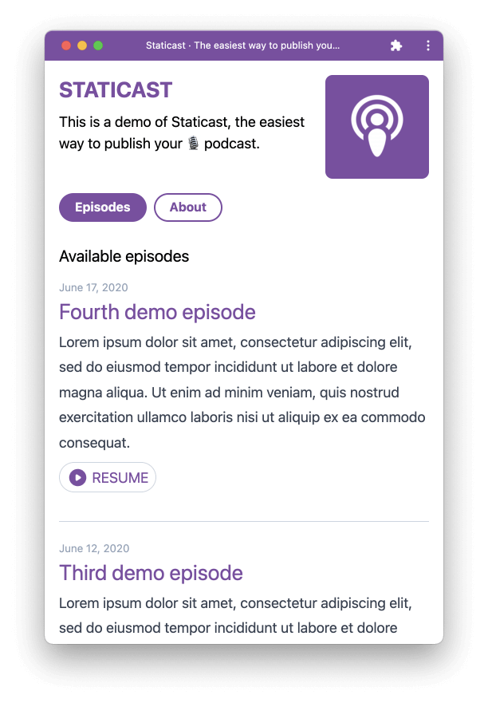

Pendant le confinement j’avais entrepris la création d’[une solution simple pour diffuser son podcast](/blog/2020-08-09-diffuser-son-podcast.md).

L’objectif était de permettre la création, de manière relativement simple, d’un site web de publication d’un podcast et de son flux [RSS](https://fr.m.wikipedia.org/wiki/Podcasting#Formats).

À l’époque [Staticast](https://staticast.cecil.app) était basé sur une version modifiée du thème de blog [Garth](https://github.com/Cecilapp/theme-garth#readme) et c’était… « un peu moche » 😅

Je l’ai donc reconçu et recodé en grande partie, de manière à en faire une **Web App**.

<!-- break -->

**Première version :**

{loading=eager}

**Nouvelle version :**

Cette nouvelle version m’a été inspirée par [Layout](https://layout.fm) (un podcast de créateurs Web) car j’aimais beaucoup l’aspect épuré et la navigation en 2 colonnes.

## Fonctionnalités

Concernant les fonctionnalités, on retrouve toujours :

- un **lecteur audio HTML natif** (donc compatible avec ensemble des navigateurs Web)
- un **flux RSS** respectant le standards du podcast
- la **mémorisation de la position de lecture** de chaque épisode
- la possibilité de **télécharger le fichier MP3** d’un épisode

Mais aussi :

- un bouton **« resume »** sur la page liste afin de reprendre la lecture d’un épisode là on l’avait stoppée
- un bouton permettant de marquer l’épisode comme **« lu » ou « non lu »**
- un bouton de [**partage natif**](https://developer.mozilla.org/fr/docs/Web/API/Navigator/share) de l’épisode (très utile sur mobile)
- une liste des **plateformes auxquelles s’abonner** (en plus du flux RSS)
- une **PWA** afin de permettre l’installation (sur mobile) et d’accéder aux épisodes **hors ligne**
- un **mode sombre** s’affichant selon le paramétrage de l’appareil (Merci [Tailwind CSS](https://tailwindcss.com))
- une **interface de gestion** des épisodes (via [Netlify CMS](https://www.netlifycms.org))

## En savoir plus

Pour en savoir plus, et surtout pour savoir comment l’installer, je vous invite à vous rendre sur [**le site dédié**](https://staticast.cecil.app), et à tester à [**démo**](https://staticast-demo.cecil.app).

