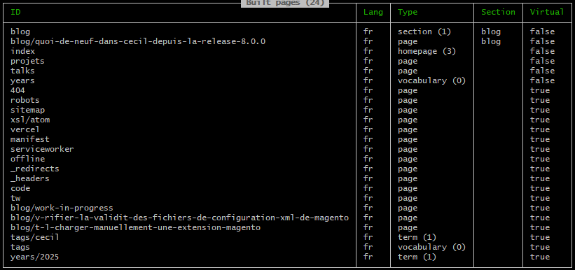

La version 8 de [Cecil](https://cecil.app) est sortie en décembre 2023, annonçant le passage à PHP 8, de nouvelles fonctionnalités et autres améliorations.

Un peu plus d’un an plus tard, qu’en est-il ?

Et bien je crois qu’on peut dire que je n’ai pas chaumé en apportant de nombreuses améliorations à Cecil et, comme prévu, le passage à PHP 8 a bien aidé à rendre le développement plus confortable pour moi.

Ce billet va prendre la forme d’un changelog, aussi détaillé que possible, tout en asseyant de ne pas être trop verbeux.
<!-- break -->

[toc]

## Nouvelles fonctionnalités

### Sort by (`8.1.0`)

Ajout d’une option de configuration de la méthode d’ordonnancement par défaut des pages :

```yaml
pages:
  sortby: date # `date`, `updated`, `title` or `weight`
  # or
  sortby:
    variable: date    # `date`, `updated`, `title` or `weight`
    desc_title: false # sort by title in descending order
    reverse: false    # reverse the sort order
```

Documentation : <https://cecil.app/documentation/configuration/#pages-sortby>

### Fichier de configuration `cecil.yml` (`8.4.0`)

Cecil utilise désormais `cecil.yml` comme fichier de configuration par défaut, mais prend toujours en charge `config.yml`.

### Ne pas ignorer les dossiers ignorés 😆 (`8.7.0`)

La commande `serve` surveille les dossiers afin de détecter un éventuel changement et ainsi déclencher un nouveau build mais, afin d’éviter les rebuilds inceptifs, prend en compte les fichiers VCS `.gitignore`.

Néanmoins, si vous avez besoin de rebuilder votre site dans tous les cas, il est possible d’utiliser l’option `--no-ignore-vcs` :

```bash
cecil serve --no-ignore-vcs
```

*[VCS]: Version Control System

### Liste des pages créées (`8.7.9`)

Vous avez la possibilité de lister les pages créées via l’option `--show-pages` 

:

```bash
cecil build --show-pages
```



## Améliorations

### Extensions (`8.2.0`)

Le code permettant d’étendre les capacités d’un projet est maintenant placé dans un dossier commun nommé « extensions » :

- `/extensions/Cecil/Generator/…`
- `/extensions/Cecil/Renderer/Extension/…`
- `/extensions/Cecil/Renderer/PostProcessor/…`

Documentation : <https://cecil.app/documentation/extend/>

### Meilleurs retours de la commande _serve_ (`8.3.0`)

- Les erreurs du serveur PHP sont désormais enregistrées dans le fichier `.cecil/errors.log`
- Cecil vérifie la disponibilité de l'hôte lorsque le serveur est en cours d'exécution
- Affichage d’un message d’erreur si le processus du serveur PHP se termine avec un code supérieur à 0
- La ligne de commande du processus du serveur PHP est désormais affichée en mode débogage

### Commande _new_ (`8.6.0`)

- Les commandes `new:*` posent désormais des questions (de configuration) lorsqu'elles sont exécutées sans options
- La commande `new:site` ne copie plus le contenu de démonstration : vous devez utiliser l'option `--demo` si le contenu de démonstration est nécessaire
- La commande `new:page` utilise désormais l’option `--name` pour définir le nom de la page

### Prise en charge des dates dans le fichier de configuration (`8.7.8`)

Si une variable de configuration est une date valide, alors celle-ci sera traitée comme un objet date et non plus comme une simple chaine de caractères (merci au composant [Symfony YAML](https://symfony.com/doc/current/components/yaml.html#date-handling)).

## Corrections

### Espaces dans le chemin vers PHP (`8.3.1`)

Dans le cas où le binaire PHP est dans un dossier contenant des espaces, la commande _serve_ échouait.
