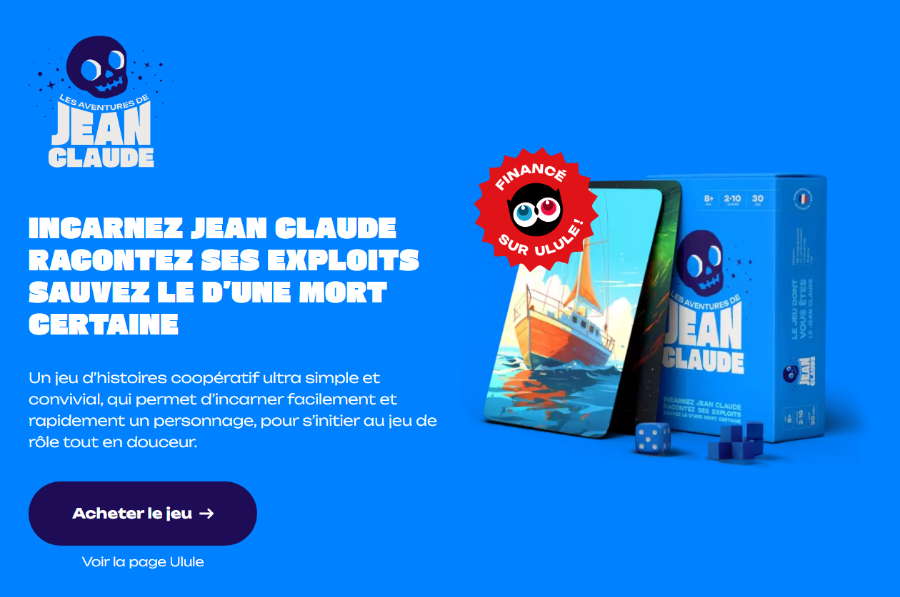

En 2024 l’équipe des éditions [Univers Détendu](https://universdetendu.com) a financé son projet de jeu sur [Ulule](https://fr.ulule.com/les-aventures-de-jean-claude/) : [Les aventures de Jean Claude](https://jeanclaude-aventures.com) 💀.

Suite à cette réussite, il était important de créer un site web afin de présenter le jeu, partager les règles au format PDF, etc.
Aussi, Cécile Ricordeau m’a demandé de créer une landing page, « avec ton [générateur de site statique](https://cecil.app) », sur la base d’un thème HTML/CSS acheté en ligne pour une bouchée de pain afin de maitriser les coûts et le temps de production.

<!-- break -->

## Création du site

J’ai donc accepté avec plaisir, parce que j’avais à la fois envie de donner un coup de main à ce super projet et aussi parce que c’était l’occasion de mettre en œuvre Cecil sur un nouveau cas d’usage.

Aussi, je m’étais d’abord concentré sur la transformation du thème, acheté, en templates Twig et… j’ai rapidement été confronté à tout un tas de mauvaises pratiques : duplication de styles CSS, abus de scripts, etc.

Bref, j’ai alors entrepris de m’inspirer du rendu global de ce thème pour en créer un sur mesure, en m’appuyant sur mes connaissances en HTML/CSS et surtout sur [Tailwind CSS](https://tailwindcss.com).

Ça m’a ainsi permis de réaliser un template de référence, très épuré, performant et respectant un maximum de bonnes pratiques afin de booster le SEO : « [Jean Claude le jeu](https://www.google.com/search?q=jean+claude+le+jeu&oq=jean+claude+le+jeu) ».

<https://jeanclaude-aventures.com>

Le résultat est simple, « propre », bien référencé et le contenu a pu facilement évoluer au fur et à mesure des évolutions du projet.

Parmi les fonctionnalités clefs de Cecil, le site exploite :

- la génération automatique des [meta tags orientés SEO](https://cecil.app/documentation/configuration/#metatags)
- l’[intégration d’une vidéo](https://cecil.app/documentation/content/#embedded-links) YouTube
- l’optimisation des images

## L’application mobile

Puis, quelques mois plus tard, l'équipe a imaginé une application web afin d'enrichir l’expérience de jeu, via un "sac à dos infini" virtuel permettant d'y piocher des idées afin d'amorcer la créativité des joueurs.

L'idée était simple :

- une page web unique compatible avec un appareil mobile/tablette
- une liste d'idées gérées via un tableur (au format CSV)
- un bouton affichant une idée piochée aléatoirement dans cette liste

De là, la DA de l’équipe a imaginé une interface simple à la manière d’un deck de cartes, une « pioche » :

")

<https://jeanclaude-aventures.com/sac/>

Je me suis donc appuyé sur le design graphique réalisé pour le site et, une nouvelle fois, sur les fonctionnalités offertes par Cecil et plus particulièrement le [composant de thème PWA](https://github.com/Cecilapp/theme-pwa) qui permet de « transformer » un site web en application web :

- génération automatique du fichier _Web manifest_ et d’un _service worker_
- mise en cache des ressources afin de rendre la page disponible hors connexion
- installation sur l’appareil si le navigateur est compatible

Les intérêts pour l’équipe sont multiples : la maintenance est inexistante, il est facile de compléter la liste des idées en modifiant un fichier CSV, et enfin le coût d’hébergement est quasi nul.

Si vous souhaitez en savoir plus sur Cecil et ses fonctionnalités, rendez-vous sur le site : https://cecil.app.

*[CSV]: Comma-separated values
