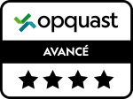
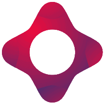
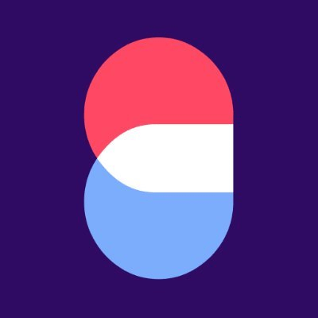
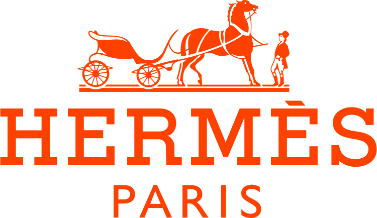
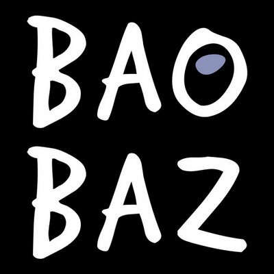

## Certifications

### Opquast®

{width=100 height=100 style="float:right;margin:1rem;"}

Maîtrise de la Qualité en projet Web ([8OQHE5](https://directory.opquast.com/fr/certificat/8OQHE5/)) .  
Excellente connaissance des règles qualité Web et du vocabulaire associé. Compétences réelles et appréciables pour participer à des projets Web.

## Expérience

### Consultant fonctionnel & technique senior

#### [Clever Age](https://www.clever-age.com) – *depuis 2022*

{width=100 height=100 style="float:right;margin:1rem;"}

👉 Consultant fonctionnelle et technique, expert e-commerce.  
Clients : Groupe Casino, Edenred, Groupe Bic, Business France, Gémo, Salomon, Focus Entertainment, Jeff de Bruges…  
Outils & solutions : VTEX, commercetools, Mirakl, Magento, Jira, Confluence, Miro, Mirakl, SAP CDC, Informatica.

<!--
### Freelance – Consultant fonctionnelle & technique web, expert e-commerce

#### [studio cecillie](https://studio.cecillie.fr) – *2020-2022*

{width=100 height=100 style="float:right;margin:1rem;"}

Clients : Valtech, Yves Rocher, Promod…  
👉 Missions de conseil et d’accompagnement technique à la mise en œuvre de solutions web, mobile et e-commerce.
-->

### Business Analyst

#### [Antadis](https://www.antadis.com) – *2022 (6 mois)*

{width=100 height=100 style="float:right;margin:1rem;"}

👉 Consultant fonctionnelle et technique, expert e-commerce.  
Clients : Grapl, Caviar Petrossian, Pharmacien Giphar, Groupe Chavigny…  
Outils & solutions : Magento, Proximis, OroCommerce.

### Consultant technique e-commerce

#### [Promod](https://www.promod.fr) – *2020-2021*

{width=100 height=100 style="float:right;margin:1rem;"}

Refonte complète du tunnel d’achat via une approche headless avec la solution [commercetools](https://commercetools.com).  
👉 Compréhension, analyse et traduction du besoin client (*discovery*);  
👉 Pilotage des ateliers techniques entre les équipes métiers et les développeurs;  
👉 Conception de l’architecture technique en accord avec la DOSI;  
👉 Conception du produit et participation au backlog en collaboration avec le business analyst, les PO et CPO, et les équipes QA.  
Outils & solutions : commercetools, Microsoft Azure (DevOps), Node.js, NestJS, Terraform, Postman, Miro, yEd.

### Co-fondateur

#### [Jamstatic](https://jamstatic.fr) – *2017-2021*

{width=100 height=100 style="float:right;margin:1rem;"}

👉 Co-administrateur de la communauté [Jamstatic](https://jamstatic.fr/), dédiée aux sites statiques et aux architectures découplées;  
👉 Co-animateur du podcast *[Génération statique](https://anchor.fm/jamstatic)* où l’on parle de sites statiques, d’architecture découplées, d’outils, de services et d’impacts, d’amour du métier, et des projets web simples et performants.

### Consultant technique senior - Web, mobile & e-commerce

#### [Adfab](https://adfab.fr) – *2015-2020*

{width=100 height=100 style="float:right;margin:1rem;"}

Clients : Saint Maclou, Tereos, Leroy Merlin, Brigad, Le petit Souk, Le Havre, The Kooples, Dermocontrol, Accor, Libeo…  
👉 Avant-vente : gestion des appels d’offres techniques, identification et recommandation des solutions techniques, chiffrages techniques, soutenances et relation clientèle;  
👉 Production : optimisation des process et méthodologies, identification des outils et technologies, suivi qualité, suivi de projet.

##### 🔎 Focus sur quelques projets

###### Du Côté de Chez Vous (Leroy Merlin)

👉 Avant-vente, accompagnement, conseils techniques et pilotage de la réalisation de la refonte du site web [Du Côté de Chez Vous](https://web.archive.org/web/20201221034701/https://www.ducotedechezvous.com).  
👉 Points d’attention : site statique généré et déployé de manière atomique, CMS headless [Contentful](https://www.contentful.com).

###### Brigad (web app et app mobile)

👉 Pilotage complet du projet « spin-off » *Planning* de la startup [Brigad](https://brigad.co) avec une équipe de 4 développeurs, et en relation directe avec le fondateur.  
👉 Points d’attention : délais court, méthodologie Agile, démo client chaque semaine en visio.

###### Saint Maclou (e-commerce)

👉 Pilotage complet du projet de refonte complet du site e-commerce Saint-Maclou.com, sur [Magento](/tags/magento), en partenariat avec l’agence [5ème Gauche](http://www.5emegauche.com).  
👉 Points d’attention : budget développement serré, optimisation des performances, outil d’aide au choix, outil de calcul de surface, connecteur CRM, store locator, déploiement continu.

###### Tereos (app mobile)

👉 Avant-vente puis conception d’une application mobile ([React Native](/tags/react-native)) visant à fournir un ensemble d’outils aux planteurs (Betterave sucrière).  
👉 Points d’attention : métier complexe, interfaces d’authentification et d’obtention des donnés, contrainte physiques fortes (connexion dégradée, mode hors-ligne), alertes push.

### Architecte IoT

#### [Dooh It](https://doohit.fr) (ex Bubbles) – *2014-2015*

{width=100 height=100 style="float:right;margin:1rem;"}

Bubbles, solution de rechargement pour smartphone, permet de développer le drive-to-store en proposant des contenus via un écran LCD et une application mobile.  
👉 Conception et prototypage du socle technique (hardware et software);  
👉 Conception du protocole de communication des objets connectés;  
👉 Recrutement et mise en place de l’équipe technique interne;  
👉 Identifications de prestataires techniques.

Technologies et outils : RabbitMQ, STOMP, Symfony, Bluetooth, NFC, iBeacon, Wi-Fi, Web App, App mobile, géolocalisation…

J’ai également collaboré avec les ingénieurs de [Canon Bretagne](https://www.canon-bretagne.fr) sur les aspects matériels et électroniques, et avec les designers de [Ova Design](http://ovadesign.com) sur la conception ergonomique.

### Consultant e-commerce & Chef de projet technique

#### [Hermès](https://www.hermes.com) – *2012-2014*

{width=100 height=100 style="float:right;margin:1rem;"}

Pilotage technique des projets e-commerce du groupe Hermès.

##### [***Hermès.com***](https://www.hermes.com)

👉 Accompagnement des chefs de projet métier Hermès sur la mise en place de nouvelles fonctionnalités (import produits, export commandes, typologie produits, web-to-store à l’international, données personnelles, version mobile…) et pilotage des prestataires technique sur le site e-commerce;  
👉 Conception fonctionnelle et technique d’un DAM sur mesure;  
👉 Pilotage technique (AMOA) du projet Cross-canal : coordination d’une quinzaine d’intervenants (métier, DSI, et prestataires) sur une durée de 6 mois.

Environnement technique : Magento (e-commerce), Cegid Business Retail (ERP), Tibco (ESB).

##### [***JohnLobb.com***](https://www.johnlobb.com)

👉 Pilotage technique de la refonte/maintenance du site e-commerce Magento : multi-devises (€, $ et £), multi-pays (Europe, UK, et USA), multi-langues (français, anglais, japonais).

##### [***Puiforcat.com***](https://www.puiforcat.com)

👉 Pilotage de la maintenance et des évolutions du site e-commerce Magento : activation du e-commerce dans plus de 30 pays.

##### [***Cristalleries Saint-Louis.com***](https://www.saint-louis.com)

👉 Pilotage de la maintenance, des optimisations des performances et de la navigation produits du site e-commerce Magento.

### Consultant technique e-commerce - Spécialiste Magento

#### Baobaz – *2009-2012*

{width=100 height=100 style="float:right;margin:1rem;"}

Clients : Zadig & Voltaire, The Kooples, Christian Louboutin, Jennyfer, Carré Blanc, Etam, 1-2-3, La Halle aux Chaussures, Burton of London…  
Référent fonctionnel et technique sur la plateforme e-commerce Magento (Enterprise et Community Edition) :  
👉 Compréhension du besoin et conseil;  
👉 Avant vente et estimation de charge;  
👉 Conception catalogue (PIM, DAM) et interfaçage (ERP, CRM, entrepôts);  
👉 Pilotage des développements, pont entre l’équipe marketing et les développeurs, sensibilisation à la performance et au SEO;  
👉 maîtrise des problématiques de cross-canal (stock, système de caisse, retrait en magasin…).

*Fashiongento*, suite de modules Magento pour les retailers et la mode :  
👉 Identification des besoins, conception fonctionnelle et technique;  
👉 Pilotage de l’équipe de développement;  
👉 Modules principaux : Silhouette, Dressing, Wishlist soldes, Promotions, Newsletter, Store locator, Checkout, Antifraude, SAV Ticketing, RMA, Carreer, Click and collect, SEO.

### Lead Developper - Spécialiste e-commerce

#### Baobaz – *2007-2010*

Clients : Repetto, Du Pareil au Même, Natalys, Marèse, Zadig & Voltaire, Texto.  
👉 Analyse, conception fonctionnelle et technique, pilotage équipe de développement, gestion de projet technique, avant vente;  
👉 Spécialiste osCommerce et Magento.

### Lead Developper - Spécialiste gestion de contenu

#### Stockho – *2005-2007*

Clients : DHL, M6, France Télévisions, Pièces Jaunes, Bergerat Monnoyeur, CUC / Abix, NewWorks, Beryl…  
👉 Analyse fonctionnelle et technique, gestion de projet technique, avant vente, TMA, expert Drupal;  
👉 Pilotage du pôle PHP, maintenance et évolution du CMS interne (EasyBao, un générateur de site statique performant et sécurisé).

*[DAM]: Digital Asset Management
*[DSI]: Direction des Services Informatiques
*[ERP]: Progiciel de Gestion Intégré
*[ESB]: Enterprise Service Bus
*[TMA]: Tierce Maintenance Applicative
*[CRM]: Customer Relationship Management
*[SEO]: Search Engine Optimisation
*[RMA]: Return Merchandise Authorization
*[PIM]: Product Information Management
*[AMOA]: Assistance à la maîtrise d’ouvrage
*[IoT]: Internet of Things
*[DOSI]: Direction Opérationnelle des Systèmes d'Information
